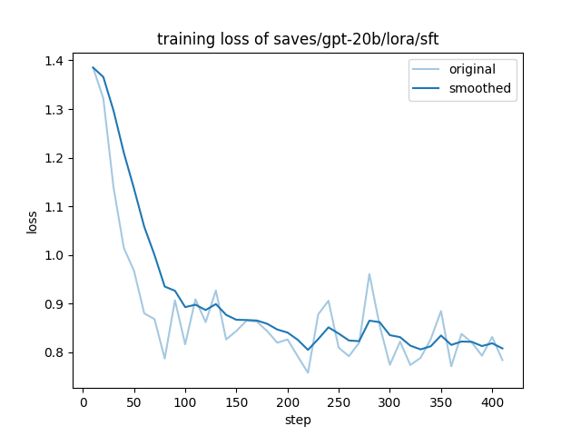

微调最佳实践
==================================================

3步实现 GPT-OSS 的 LoRA 微调
-------------------------------------------------------

1. 安装 LLaMA-Factory 和 transformers
~~~~~~~~~~~~~~~~~~~~~~~~~~~~~~~~~~~~~~~~~~~~~~~
.. code-block:: bash

   git clone --depth 1 https://github.com/hiyouga/LLaMA-Factory.git
   cd LLaMA-Factory
   pip install -e ".[torch,metrics]" --no-build-isolation
   pip install "transformers==4.55.0"

2. 在单张 GPU 上训练 GPT-OSS（要求显存 > 44 GB, 支持多 GPU）
~~~~~~~~~~~~~~~~~~~~~~~~~~~~~~~~~~~~~~~~~~~~~~~
.. code-block:: bash

   llamafactory-cli train examples/train_lora/gpt_lora_sft.yaml

3. 合并 LoRA 权重
~~~~~~~~~~~~~~~~~~~~~~~~~~~~~~~~~~~~~~~~~~~~~~~
.. code-block:: bash

    llamafactory-cli export --model_name_or_path openai/gpt-oss-20b \
        --adapter_name_or_path saves/gpt-20b/lora/sft \
        --export_dir gpt_merged

与微调后的模型进行对话
~~~~~~~~~~~~~~~~~~~~~~~~~~~~~~~~~~~~~~~~~~~~~~~
.. code-block:: shell

   llamafactory-cli chat --model_name_or_path gpt_merged --template gpt --skip_special_tokens False

完整微调脚本
~~~~~~~~~~~~~~~~~~~~~~~~~~~~~~~~~~~~~~~~~~~~~~~
参见 `#8837 <https://github.com/hiyouga/LLaMA-Factory/issues/8837>`_

使用 Web UI 微调模型：

.. image:: ../assets/advanced/gpt-20b-webui.png
   :alt: 使用 Web UI 微调 gpt-oss
   :align: center
