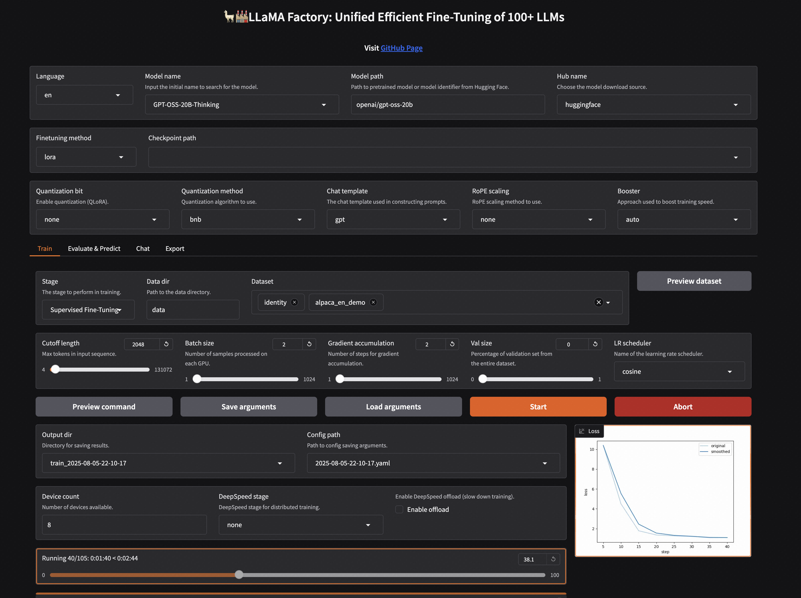

Fine-Tuning Best Practice
==================================================

Apply LoRA Fine-Tuning on GPT-OSS model in 3 steps
-------------------------------------------------------

1. Install LLaMA-Factory and transformers
~~~~~~~~~~~~~~~~~~~~~~~~~~~~~~~~~~~~~~~~~~~~~~~
.. code-block:: bash

   git clone --depth 1 https://github.com/hiyouga/LLaMA-Factory.git
   cd LLaMA-Factory
   pip install -e ".[torch,metrics]" --no-build-isolation
   pip install "transformers==4.55.0"

2. Train GPT-OSS on a single GPU (> 44GB) (multi-GPU is also supported)
~~~~~~~~~~~~~~~~~~~~~~~~~~~~~~~~~~~~~~~~~~~~~~~

.. code-block:: bash

   llamafactory-cli train examples/train_lora/gpt_lora_sft.yaml

3. Merge the LoRA weight into the base model
~~~~~~~~~~~~~~~~~~~~~~~~~~~~~~~~~~~~~~~~~~~~~~~

.. code-block:: bash

    llamafactory-cli export --model_name_or_path openai/gpt-oss-20b \
        --adapter_name_or_path saves/gpt-20b/lora/sft \
        --export_dir gpt_merged

(Optional) Chat with the fine-tuned model
~~~~~~~~~~~~~~~~~~~~~~~~~~~~~~~~~~~~~~~~~~~~~~~

.. code-block:: shell

   llamafactory-cli chat --model_name_or_path gpt_merged --template gpt --skip_special_tokens False

Full fine-tuning recipes
~~~~~~~~~~~~~~~~~~~~~~~~~~~~~~~~~~~~~~~~~~~~~~~

See `#8837 <https://github.com/huggingface/transformers/blob/main/src/transformers/models/llama4/processing_llama4.py#L157>`_

Use Web UI to fine-tune the model:

